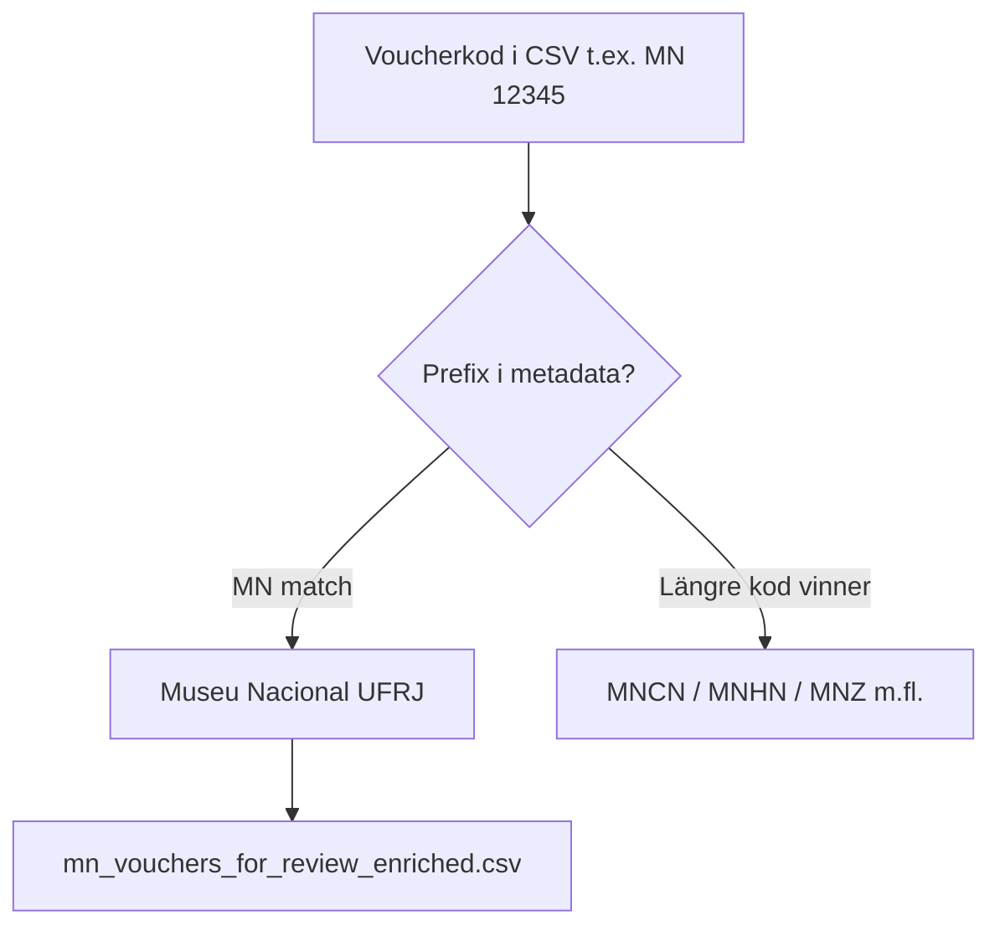

# MN-prefix — research report v3 (städad)

> **Status (2026-05):** Slutsatsen är **implementerad** i repot (`MN` i `TypeSpecimenMetadata_v2.4.csv`, commit `3e0368a`).  
> **Tillförlitlig data:** [`mn_vouchers_for_review_enriched.csv`](mn_vouchers_for_review_enriched.csv) — kopierar typlokaliteter oförändrat från MDD.

## Varning om originalversionen av v3

Den automatgenererade v3-rapporten innehöll ett inbäddat CSV-block med **felaktiga typlokaliteter** (t.ex. `Trinomys_paratus` som „Amboseli, Ghana“, `Cerradomys_goytaca` med fel parknamn) och **saknade ~8 arter** av 54. **Använd inte det CSV-blocket.** Detta dokument ersätter den versionen.

## Exekutiv sammanfattning

Alla **54** arter med voucher-prefix **MN** eller **MN-UFRJ** tillhör **Museu Nacional, Universidade Federal do Rio de Janeiro** (MNRJ), Rio de Janeiro, Brasilien.

| Prefix | Exempel | Lösning | Säkerhet |
|--------|---------|---------|----------|
| `MN` | `MN 31910`, `MN 78680` | Museu Nacional (UFRJ) — metadata-kod **`MN`** | Hög |
| `MN-UFRJ` | `MN-UFRJ 23075` | Samma institution; täcks av `MN`-prefix (longest-prefix) | Hög |

### Monodelphis pinocchio (MN 78680)

Vissa sekundärkällor har felaktigt citerat AMNH. **Pavan et al. 2015** listar holotypen uttryckligen som `MN 78680` från Reserva Florestal do Morro Grande, Cotia, São Paulo ([AMNH Novitates 3832](https://digitallibrary.amnh.org/server/api/core/bitstreams/9864b9ec-11a5-4018-819e-59f4053bc3ab/content)).

**Vendramel et al. 2025** ([Papéis Avulsos de Zoologia — MZUSP-däggdjurskatalog](https://doi.org/10.11606/1807-0205/2025.65.021)) kunde **inte verifieras** som primärkälla för MN 78680 / MNRJ (artikeln avser typer i **MZUSP**, inte MNRJ-katalogen). Därför används Pavan 2015 + OBIS/SiBBr som evidens i enriched CSV.

## Bearbetningslogik



## Implementerat i repot

- `TypeSpecimenMetadata_v2.4.csv` — rad **`MN`**
- `mn_vouchers_for_review.csv` — 54 rader (MDD-källa)
- `mn_vouchers_for_review_enriched.csv` — samma 54 rader + museikolumner
- `deep-research-report.md`, `deep-research-report_2.md` — tidigare research-iterationer

Regenerera enriched CSV:

```bash
python mdd_project/scripts/export_mn_vouchers_for_review.py
```

## Källor (klickbara)

- [Pavan et al. 2015 — AMNH Novitates 3832](https://digitallibrary.amnh.org/server/api/core/bitstreams/9864b9ec-11a5-4018-819e-59f4053bc3ab/content) — förkortningen MN = Museu Nacional UFRJ; holotyp MN 78680
- [OBIS — Museu Nacional UFRJ (institute 13167)](https://obis.org/institute/13167)
- [SiBBr — Coleção de Mamíferos MNRJ](https://collectory.sibbr.gov.br/collectory/public/show/dr797)
- [Mammal Diversity — Abrawayaomys ruschii (MN-UFRJ 23075)](https://www.mammaldiversity.org/)
- [Vendramel et al. 2025 — MZUSP mammal types (sekundär; ej verifierad för MN 78680)](https://doi.org/10.11606/1807-0205/2025.65.021)

## Enriched CSV — kolumner

Se [`mn_vouchers_for_review_enriched.csv`](mn_vouchers_for_review_enriched.csv). Kolumner:

`sci_name`, …, `type_lat`, `type_lon`, `museum_full_name`, `museum_city`, `museum_country`, `institution_code`, `confidence`, `source_url`, `notes`

Exempel (2 rader — full lista i CSV-filen):

```csv
sci_name,type_voucher,museum_full_name,institution_code,confidence,notes
Abrawayaomys_ruschii,MN-UFRJ 23075,"Museu Nacional, Universidade Federal do Rio de Janeiro",MN (MNRJ),Hög,
Monodelphis_pinocchio,MN 78680,"Museu Nacional, Universidade Federal do Rio de Janeiro",MN (MNRJ),Hög,"Holotype MN 78680 at Museu Nacional; Pavan et al. 2015 AMNH Novitates 3832."
```
